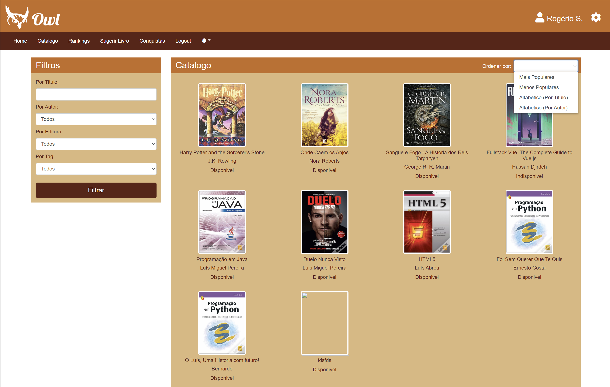
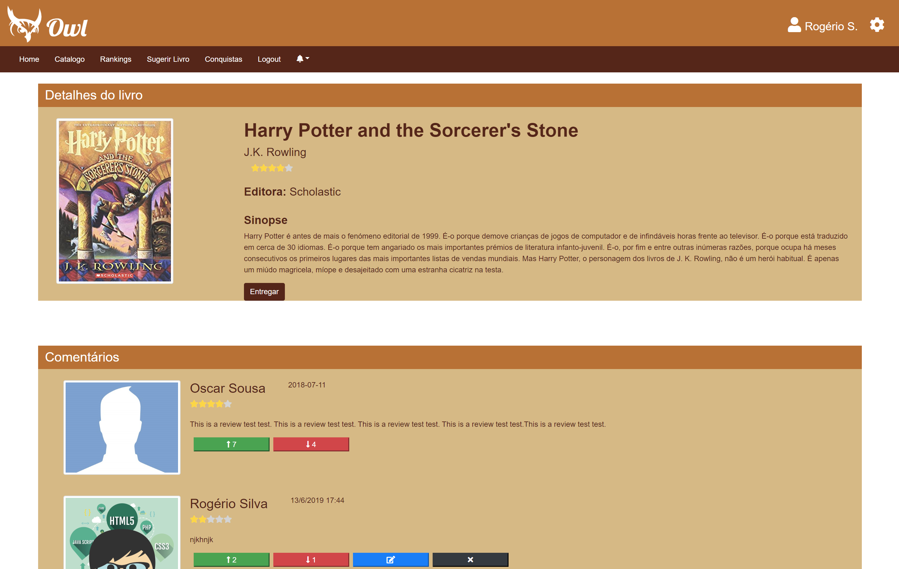
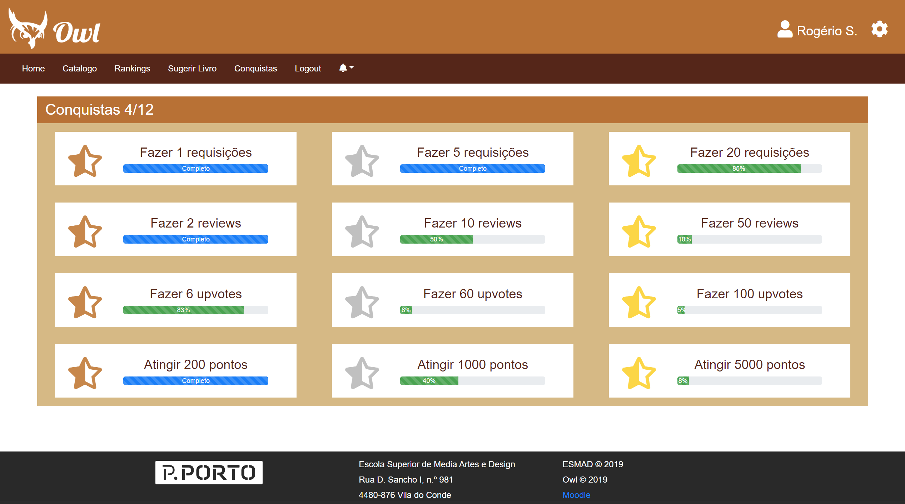
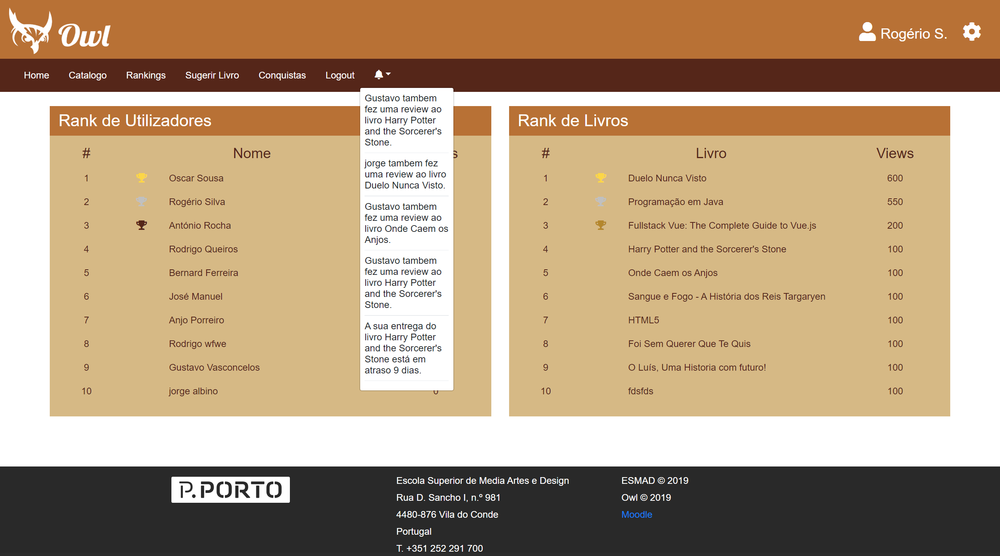
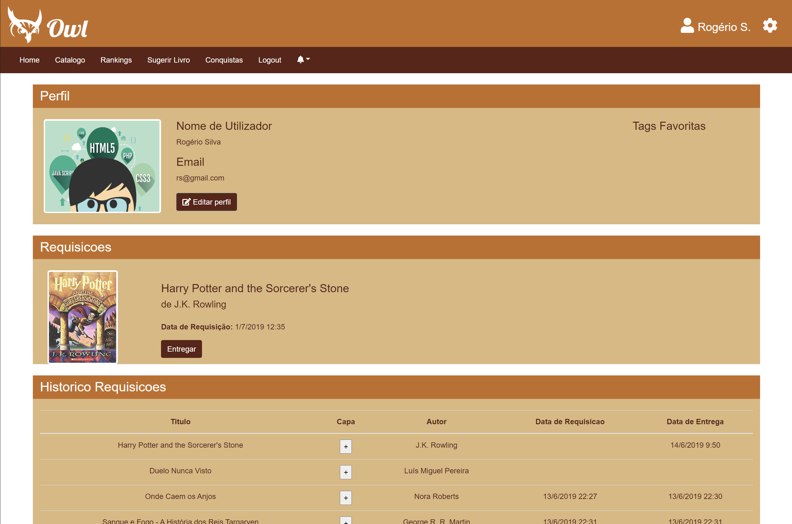
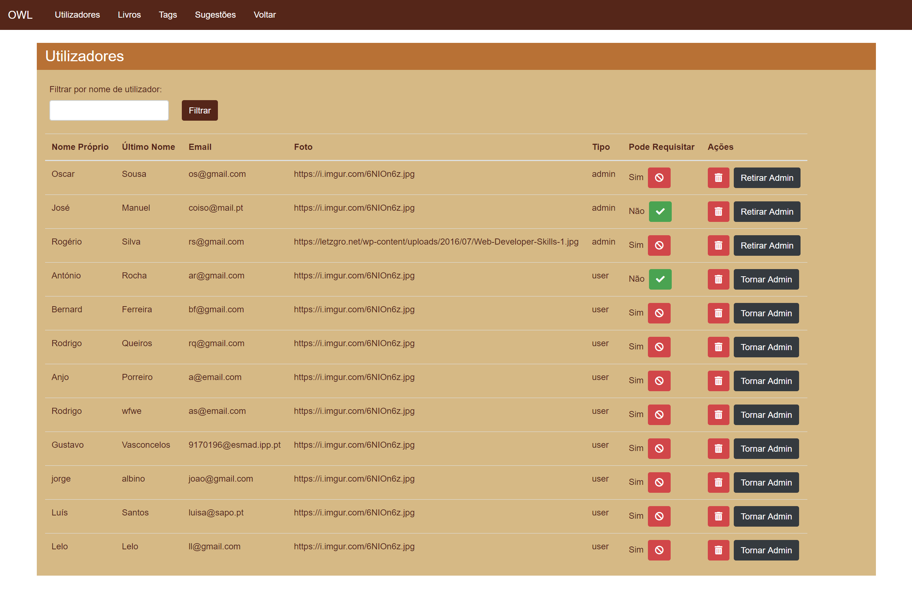
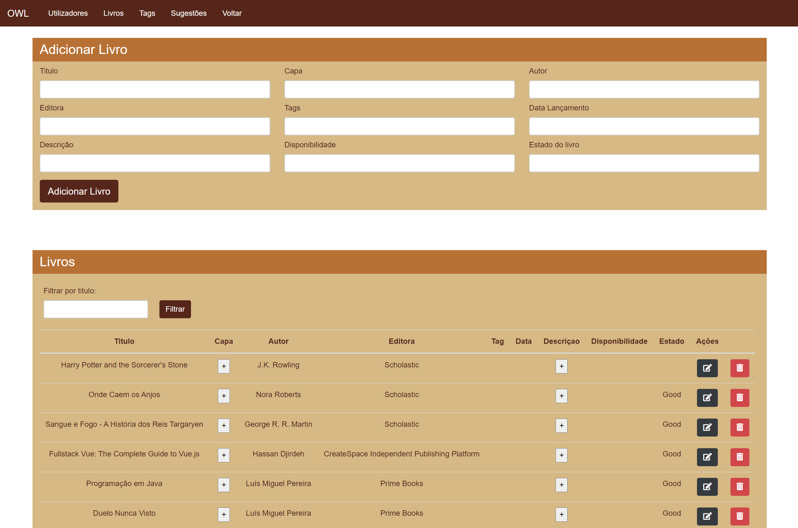

# Owl


## About

Owl is a online library made for the curricular unit of Web Programing 1.

The use of our app, for the most part, is directed to the university libray and its objective is to manage books/magazines, manage book requests, list the books/magazines with filters and notify the users.

## Try it

https://owl-client.herokuapp.com/#/

https://owl-server-pw2.herokuapp.com/

### Plugins and dependencies:
* Vue CLI.
* Vue Router.
* Vuex.
* SweetAlert2

## Repository structure 

```mermaid

Owl  
--(node_modules) 
--(public)
--(src)
-----(assets)
-----(componets)
-----(views)
```

# FAQ

### Why Owl?
"The owl spirit animal is emblematic of a deep connection with wisdom and intuitive knowledge. If you have the owl as totem or power animal, you’re likely to have the ability to see what’s usually hidden to most." - Elena Harris, SpiritAnimal.info

## Project setup

### Git clone
```
git clone https://github.com/RodrigoQueiros/Owl---PW1-Project.git
```

### NPM
```
npm install
```

### Compiles and hot-reloads for development
```
npm run serve
```

### Compiles and minifies for production
```
npm run build
```

### Run your tests
```
npm run test
```

### Lints and fixes files
```
npm run lint
```

### Customize configuration
See [Configuration Reference](https://cli.vuejs.org/config/).

## Interface

### Catalog page


### Book Page


### Achievements page


### Rankings page and Notifications


### Rankings page and Notifications


### Perfil page


### Back office users


### Back office books


### Poster


### Authors

* **Antonio Rocha** - [AFGRocha](https://github.com/AFGRocha)

* **Bernardo Ferreira** - [BernardoCaiano](https://github.com/BernardoCaiano)

* **Rodrigo Queirós** - [RodrigoQueiros](https://github.com/RodrigoQueiros)


